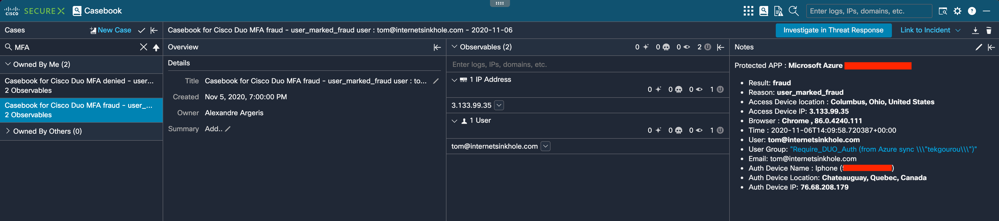
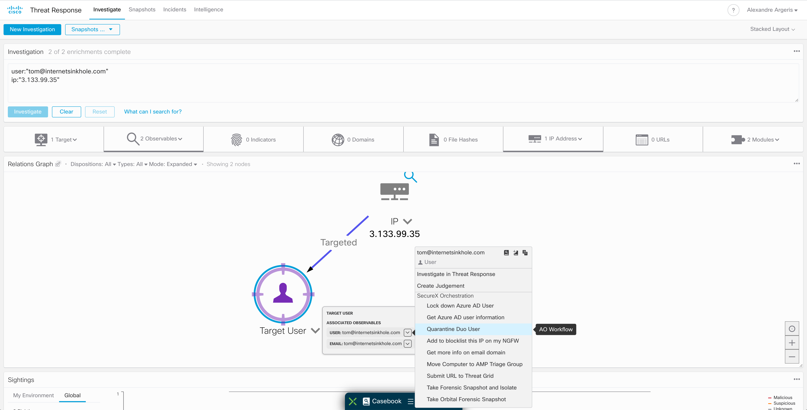
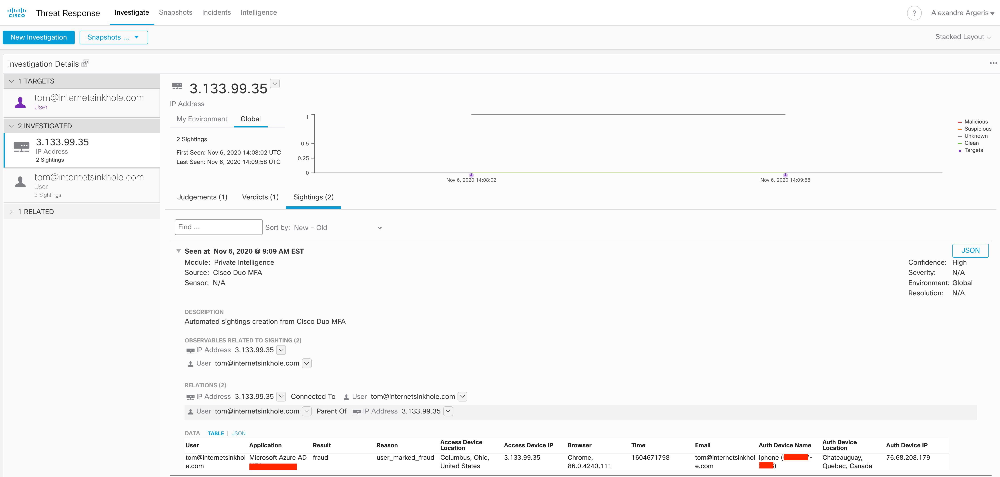
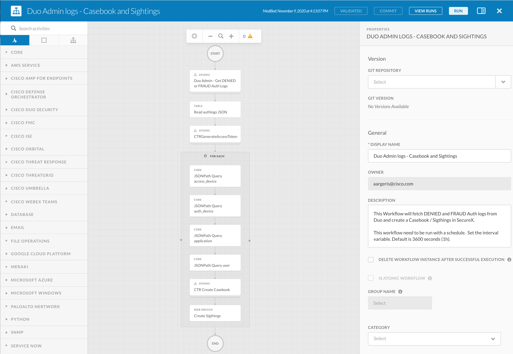

# Duo SecureX Orchestration workflows

Create SecureX Casebook and Sigthings based on Duo Auth DENIED or FRAUD logs.

Use cases : 
  - Track compromised Duo accounts
  - Track Access Device and Auth Device IP and or country mismatch
  - Track the potential source IP of guessing password scan
  - Block Duo user in CTR
  - Link cybercriminals IP(s) from a NGIPS event to a Duo denied authentication log during an investigation

For any questions or comments/bugs please reach out to me at alexandre@argeris.net or aargeris@cisco.com

 

 

 

# Main workflows:

- Duo Admin logs - Casebook and Sightings.json
  This workflow will fetch Duo (DENIDED or FRAUD) logs every 1hour (can be set by modifying the variable - interval - ) and parse the output to create a casebook and sigthings in SecureX platform. 
  

   

# Prerequisites:

- Create an Admin API application in Duo and save the credentials.
    https://duo.com/docs/adminapi
    
- Copy these credentials into Cisco SecureX Orchestration variable section:

  - Admin Integration Key (iKey), Host as a string variables [duo_admin_ikey], [duo_host]
  - Admin Secret Key (sKey) as a Secure string variable [duo_admin_skey]

- Create the Duo Target based on the hostname in the Cisco SecureX Orchestration. 

  - Give a name, like "Duo"
  - No account keys: True
  - HTTPS protocol, host/IP address: API hostname
  - Proxy: Ignore Proxy
  
- Use this "Duo" target in the workflows selecting "Override workflow target" option and "Duo" target.

# Import these workflows into SecureX Orchestration as atomic workflows:
  
- CTRGenerateAccessToken.json

  This Atomic workflow action will get CTR access token.

- CTR Create Casebook.json 

  This Atomic workflow actions will create Casebook.  
  
- Duo Admin - Get DENIED or FRAUD Auth Logs.json

  This Atomic workflow action will fetch Duo auth denied and fraud logs.

# Remediation workflows

- Duo Admin - Block User By Username.json  

  This Atomics workflow action block a Duo user based on username. (Work only if the Duo user is local - not sync with Azure AD or Win AD)
  credit to https://github.com/Gyuri1/duo-sxo
  
- Quarantine Duo User.json
  This workflow give you access to quarantine user in Duo from the SecureX AO contextuel menu.
  
- Azure AD - lockdown user (not documented yet)
